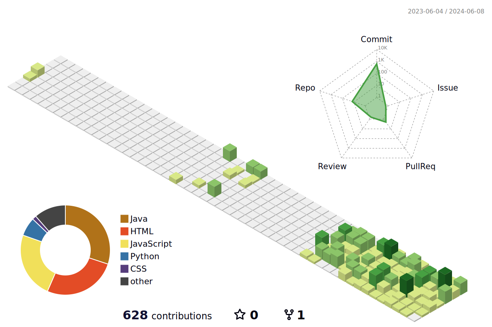

  

### 
🫡Welcome my github!

### 🔥Studying

  

 

### 💻Tech stack 

  

    
    
    
    
    
    
  

  
  
    
    
    
  

  

    
  

  

### 🔧Tools

    

      </img>
      </img>
      </img>
    

    

      </img>
      </img>
      </img>
    

  

### ✉️contact

  
  

 

